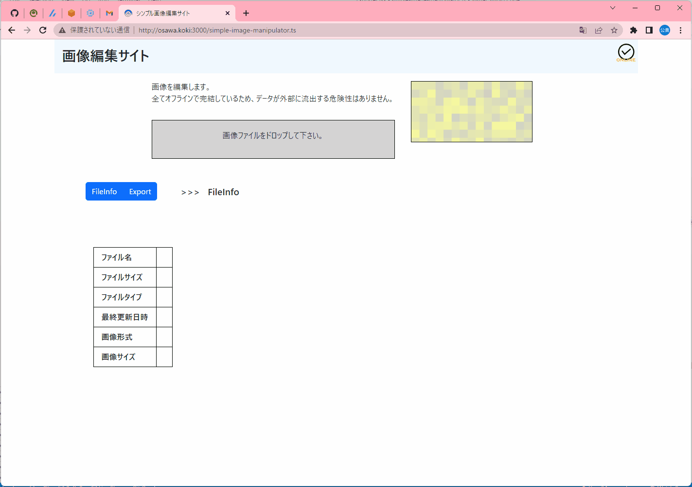

# simple-image-manipulator.ts

拡張子(画像フォーマット)の変更、画像サイズの変更、グレースケール化、などの基本的な画像編集ができるサイト。  
Reactで実現。  

  

## 補足

Nodeのバージョンをv19.3.0にあげるとscssコンパイルエラーが発生。  
ローカル環境の汚染防止のために、DevContainerでNodeのバージョンを18に下げて実行する。  

本番環境(GitHub Actions)も同様に18でビルドする。  

## 参考文献

- [jimp](https://www.npmjs.com/package/jimp)  
